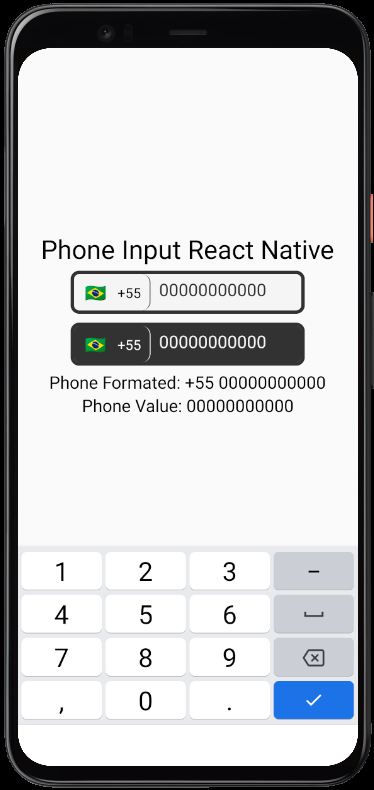
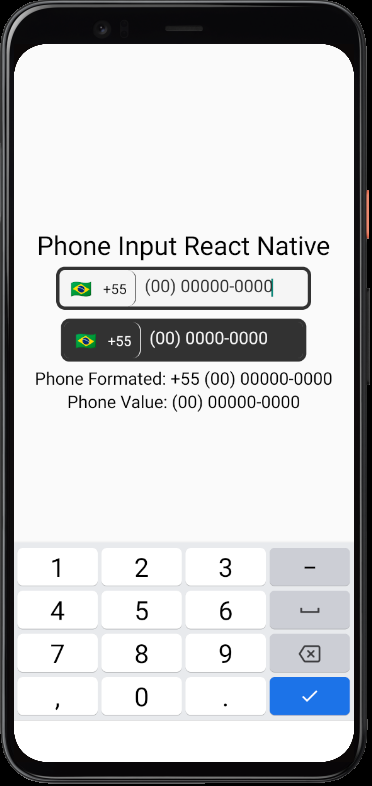

<div align="center">
  

  
</div>
<br>
<h1 align="center">Phone Input React Native
</h1>

# Como usar?

## instalação
Utilize npm:
```shell
$ npm install input-phone-rn-br
```
ou yarn:
```shell
$ yarn add input-phone-rn-br
```

<br>

## Importando a biblioteca
```ts
import PhoneInputRn from "input-phone-rn-br"
```
## Exemplo de uso
```tsx
import React, {useState} from "react";
import {SafeAreaView, StyleSheet, Text} from "react-native";
import PhoneInputRn from "input-phone-rn-br";

const App = () => {
  const [value, setValue] = useState<string>('');
  const [phoneFormated, setPhoneFormated] = useState<string>('');

  return (
    <SafeAreaView style={styles.container}>
      <Text style={styles.text}>Phone Input React Native</Text>
      <PhoneInputRn
        value={value}
        onChangeText={(text) => setValue(text)}
        setPhoneFormated={setPhoneFormated}
        withDarkTheme={false}
      />

      <Text style={{fontSize: 20}}>Phone Formated: {phoneFormated}</Text>
      <Text style={{fontSize: 20}}>Phone Value: {value}</Text>
    </SafeAreaView>
  );
};

const styles = StyleSheet.create({
  container: {
    flex: 1,
    alignItems: 'center',
    justifyContent: 'center',
  },
  text: {
    fontSize: 30,
  },
});

export default App;
```

<br>

## Props
<!-- - `value`: boolean
- `onChangeText`: (text: string) => void
- `autoFocus?`: boolean
- `placeHolder?`: string
- `inputMaxLenth?`: number
- `cellFormat?`: boolean
- `telephoneFormat?`: boolean
- `phoneFullFormat?`: string
- `setPhoneFormated?`: (text: string) => void
- `withDarkTheme?`: boolean
- `containerStyle?`: `StyleProp<ViewStyle>`
- `containerButtonStyle?`: `StyleProp<ViewStyle>`
- `selfRef`?: `React.LegacyRef<TextInput>`
 -->
 | Prop  | Tipagem | Descrição | Obrigatório
| :------------ |:---------------| :---------------| :---------------|
| value | `boolean` | Defini o valor do input | ✔ |
| onChangeText | `(text: string) => void` | Quando o texto sofre qualquer alteração ele chama essa função. | ✔ |
| autoFocus | `string` | Determina se ele irá começar focado. | ❌ |
| placeHolder | `string` | Texto ilustrativo dentro do input. | ❌ |
| inputMaxLenth | `number` | Determina um numero maximo de caracteres no input. | ❌ |
| cellFormat | `boolean` | Define se a mascara interna sera no formato de celular. | ❌ |
| telephoneFormat | `boolean` | Define se a mascara interna sera no formato de telefone. | ❌ |
| phoneFullFormat | `string` | Retorna o numero completo, ex: (11) 22 34444-4444 | ❌ |
| setPhoneFormated | `(text: string) => void` | Chama a função que atualiza o telefone completo. | ❌ |
| withDarkTheme | `boolean` | Troca o tema do input. | ❌ |
| containerStyle | `StyleProp<ViewStyle>` | Define um estilo próprio para o container do input. | ❌ |
| containerButtonStyle | `StyleProp<ViewStyle>` | Define um estilo próprio para o select do input (estilo externo). | ❌ |
| selfRef | `React.LegacyRef<TextInput>` | Use um useRef para interagir diretamente com o input. | ❌ |
<br>

## Agradecimentos
- [React-native-country-picker-modal
](https://github.com/xcarpentier/react-native-country-picker-modal) é uma biblioteca de "country select" exlucisiva para react native que possibilitou a criação dessa lib;

- [React Native Phone Number Input](https://github.com/garganurag893/react-native-phone-number-input) é uma biblioteca semelhante que inspirou esse projeto ser criado.

<h5 align="center">Made with ❤️ by developer for developers</h6>
